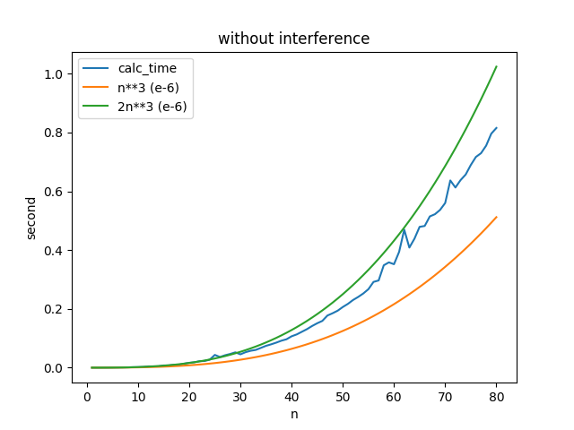
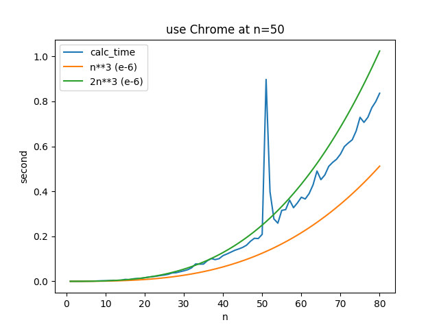
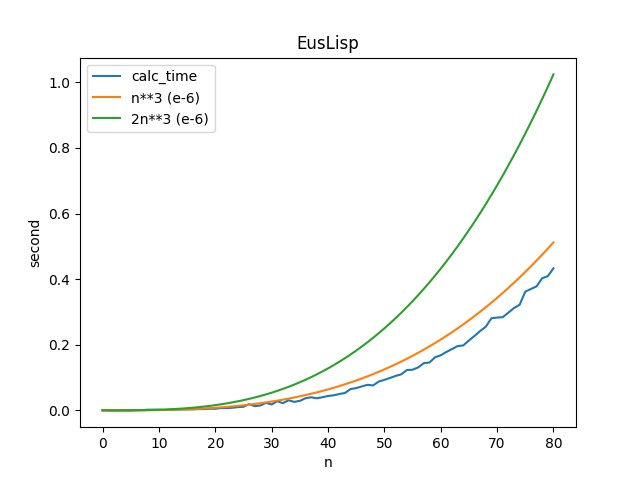

## STEP Week2

### 宿題1<br>
行列積を求めるプログラムを書いて、行列のサイズNと実行時間の関係を調べてみよう<br>

プログラム：[calc_mat_mal_time.py](https://gist.github.com/MiyabiTane/d1f8c0b6858aa94dc017bd4d9bd5914c)<br>
```
python3 ./visualize.py
```
を実行するとNと時間の関係を可視化することができる<br>


<br>

左のグラフはプログラムの実行中に何も危害を加えなかった時のグラフで、時間計算量O(n\**3)になっていることが分かる。更に言うと2n**3になっている。<br>
右のグラフはn=50あたりでプログラムを実行しているPCでGoogle Chromeの新規タブを開いてみた結果である。その時だけ掛かる時間が跳ね上がっていることが見て取れる。時間計算量はあくまで目安であり、実際には環境に大きく左右されることが分かった。<br>

せっかくなので他の人が使わなさそうな言語、EusLispでも書いてみる。<br>
```
roscore
```
（別端末で）
```
roseus homework1.l
```
として実行する。ただし、EusLispが使える環境である必要がある。(私はLinuxで実行しています)<br>
ターミナルに表示された時間をコピーしてテキストファイルmatmal_time.txtとし保存し、
```
python3 ./visualize_time_lisp.py
```
を実行すると以下のようなグラフが得られた。<br>

<br>
積の求め方はpythonと同じなので時間計算量はO(n**3)になっていた。しかし、定数係数が約１になっていて、pythonよりEusLispの方が計算が早いことが見て取れた。<br>


###　宿題２<br>

木構造を使えばO(log N)、ハッシュテーブルを使えばほぼO(1)で検索・追加・削除を実現することができるが、現実の大規模なデータベースでは、ハッシュテーブルではなく木構造が使われることが多い。その理由を考えよ。<br>
→ homework2.txt

### 宿題３<br>

次の操作をほぼO(1)で実現するデータ構造を考えよう<br>
・与えられた<URL, Webページ>があるかないかを検索する<br>
・もしない場合、キャッシュ内で一番古い<URL, Webページ>を捨てて、かわりに与えられた<URL, Webページ>を追加する<br>
→ homework3.txt


### 宿題４<br>

宿題３で考えた方法を実装してみよう<br>

**辞書を２つ使う方法**<br>
[cache_using_two_dicts.py](https://gist.github.com/MiyabiTane/846157612c352f3e0403aa7e968e79aa)<br>
```
python3 ./cache_using_two_dicts.py
```
ただし、この方法では一番最後に見たURLは簡単に取り出せるが、最近見たURL複数個を見た順に取り出すことがO(1)でできない。<br>

**リストと辞書を使う方法**<br>
[cache_using_list_and_dict.py](https://gist.github.com/MiyabiTane/1d811ca2d7563f9a371953eb08c6af68)
```
python3 ./cache_using_list_and_dict.py
```
この方法なら全てO(1)で実行できる（と思う）。<br>


