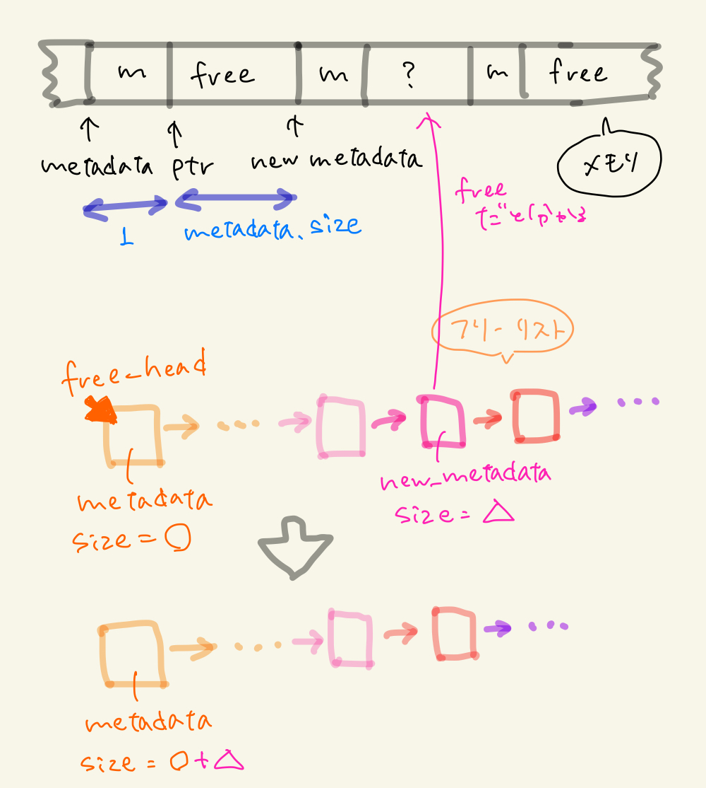

## STEP Week6

### 宿題1<br>
```
def foo(b):
   b.append(2)
   b = b + [3]
   b.append(4)
   print('b:', b)
a = [1]
foo(a)
print('a:', a)
```
を実行すると出力は
```
b: [1, 2, 3, 4]
a: [1, 2]
```
となる。<br>

この関数について、idを使って各変数が指しているアドレスをprintしたうえで、メモリ上でのどのようにデータが保管されているかを説明する。<br>
それを踏まえた上で、なぜ関数内で実行したappendが関数の外で定義した変数に影響を及ぼしてしまうのかを説明する。<br>


a,bだけでなく、その配列の中身のidもprintした。
```
python3 ./homework1.py
```
とすると出力は<br>
```
id(a): 0x10303a1e0
id(b): 0x10303a1e0
id(b[0]): 0x102f37f20
id(b[0]): 0x102f37f20
id(b[1]): 0x102f37f40
id(b): 0x10303a1e0
id(b): 0x103281d70
id(b[0]): 0x102f37f20
id(b[1]): 0x102f37f40
id(b[2]): 0x102f37f60
id(b): 0x103281d70
id(b[0]): 0x102f37f20
id(b[1]): 0x102f37f40
id(b[2]): 0x102f37f60
id(b[3]): 0x102f37f80
b :  [1, 2, 3, 4]
id(a): 0x10303a1e0
a :  [1, 2]
```
となった。この結果から以下のようなことが考えられる。なお、図はメモリを簡略化したものであり、ポインタの番号も説明のために適当に割り振っている。<br>

1. まず、a = [1]とfoo(a)のaは代入しただけなので同じポインタを持つ。以下、ポインタ*1e0を持つaをa(*1e0)と表すこととする。<br>
2. fooの中身を見ていく。def foo(b)のbとしてaを代入したのでこのbはaと同じポインタ(*1e0とする)を持つ。<br>
3. b(*1e0).append(2)、b(*1e0) = [1,2]
4. b = b + [3]。この時、bはb(*d70) = b(*1e0) + [3]となる。<br>
つまり、b(*d70) = [1,2,3], b(*1e0) = [1,2]である。<br>
5. b(*d70).append(4)、b(*d70) = [1,2,3,4]<br>
6. print(b)のbはb(*d70)なので[1,2,3,4]がprintされる。<br>また、print(a)のaはa(*1e0)なのでa(*1e0) = b(*1e0) = [1,2]となり、[1,2]がprintされる。<br>

以上の理由より、aは関数内の計算の影響を受ける。また、それがbと異なった値になる。<br>

<table>
<tr>
<td></td>
<td></td>
</tr>
</table>
<table>
<tr>
<td></td>
<td></td>
</tr>
</table>
<table>
<tr>
<td></td>
</tr>
</table>

### 宿題２<br>
mmapとmunmapを使って最強の malloc / free を作ってみよう！！ <br>
最強に効率がよいメモリ管理のアルゴリズムを考えよう<br>

効率がよいとは？<br>
1. 速い
2. 使用率（実際に使っている領域/mmapした領域）が高い

＜方法１＞<br>
free_listの頭に新しくリストが追加される度に、その隣のmetadata(アドレスcur_metadata+1+size)がfree_listに含まれているかを調べ、含まれていれば合体させる。<br>
```
gcc malloc_unite_free.c -lm
./a.out
```
結果
```
Challenge 1: simple malloc => my malloc
Time: 24 ms => 1720 ms
Utilization: 70% => 70%
==================================
Challenge 2: simple malloc => my malloc
Time: 18 ms => 979 ms
Utilization: 40% => 40%
==================================
Challenge 3: simple malloc => my malloc
Time: 290 ms => 14276 ms
Utilization: 8% => 17%
==================================
Challenge 4: simple malloc => my malloc
Time: 30473 ms => 88432 ms
Utilization: 15% => 29%
==================================
Challenge 5: simple malloc => my malloc
Time: 29100 ms => 105938 ms
Utilization: 15% => 24%
==================================

```
時間はかなりかかってしまうが、使用率が上がっていることがわかる。<br>

＜方法２＞<br>
さらに使用率を上げるため、munmap_to_system()で不要になったsize4096の領域をシステムに返すことにした。具体的には、一番最後にmmapしてきた領域のメタデータを覚えておき、free_listにそのメタデータが含まれる、かつ大きさが4096以上ならmunmapするようにした。
```
gcc malloc_unite_free_munmap.c -lm
./a.out
```
結果
```
Challenge 1: simple malloc => my malloc
Time: 21 ms => 3233 ms
Utilization: 70% => 70%
==================================
Challenge 2: simple malloc => my malloc
Time: 21 ms => 1754 ms
Utilization: 40% => 40%
==================================
Challenge 3: simple malloc => my malloc
Time: 549 ms => 26620 ms
Utilization: 8% => 17%
==================================
Challenge 4: simple malloc => my malloc
Time: 33187 ms => 122082 ms
Utilization: 15% => 29%
==================================
Challenge 5: simple malloc => my malloc
Time: 29120 ms => 162697 ms
Utilization: 15% => 24%
==================================
```
残念ながら時間だけ増えて使用率は変わらなかった。全てのmmap領域を記憶するようにすればもう少し使用率が上がりそう。実装しようとしたがリストをもう一つ作ったら混乱して挫折した。<br>

＜方法３＞
Best-fitと空白連結の方法（方法１）を組み合わせた。Best-fitでは、フィットするものがなかった時、一番大きさが近いものを取ってくるようなプログラムにしようとしたらうまくいかなかった（多分凡ミス）ので、フィットするものがなかったらFirst-fitに切り替えるようにした。結果的にこれが時間短縮に繋がった気がする。<br>
また、空白連結の際に、free_headの方に連結するような仕組みにしたため、first-fitをする際に空いている領域をすぐに見つける確率が高くなっており、それも高速になった理由の一つかもしれない。<br>
<br>
```
gcc malloc_unite_free_munmap.c -lm
./a.out
```
結果
```
Challenge 1: simple malloc => my malloc
Time: 21 ms => 1237 ms
Utilization: 70% => 70%
==================================
Challenge 2: simple malloc => my malloc
Time: 19 ms => 692 ms
Utilization: 40% => 40%
==================================
Challenge 3: simple malloc => my malloc
Time: 276 ms => 832 ms
Utilization: 8% => 50%
==================================
Challenge 4: simple malloc => my malloc
Time: 32967 ms => 2777 ms
Utilization: 15% => 76%
==================================
Challenge 5: simple malloc => my malloc
Time: 24778 ms => 1851 ms
Utilization: 15% => 78%
==================================
```
これが一番良い結果となった。<br>


