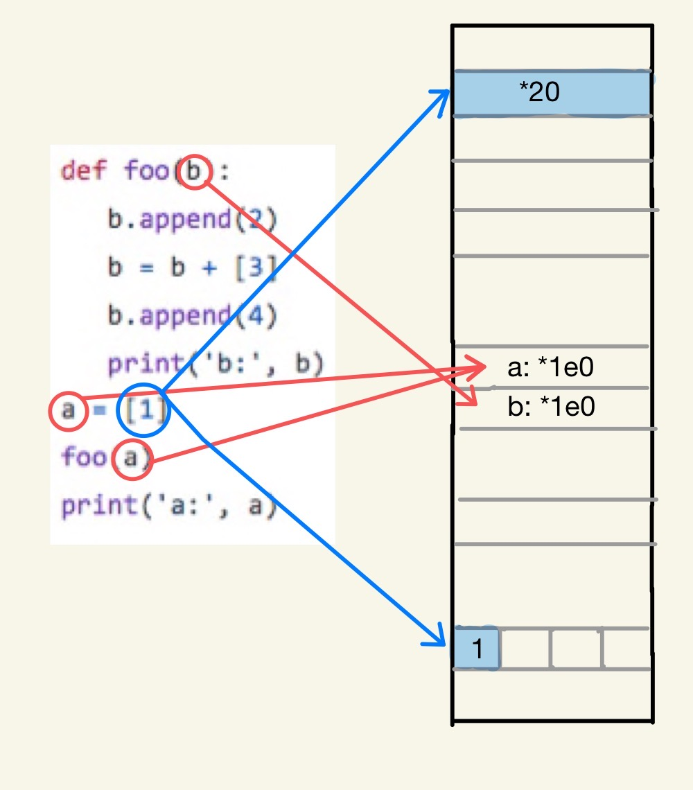
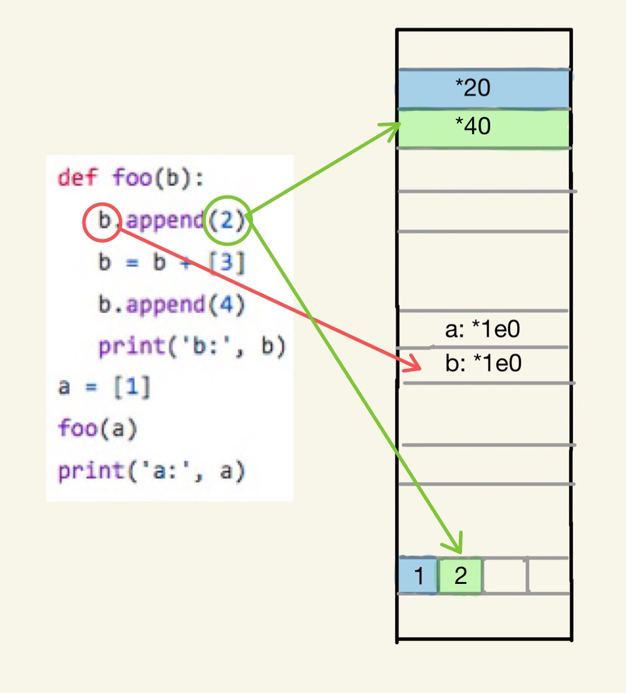
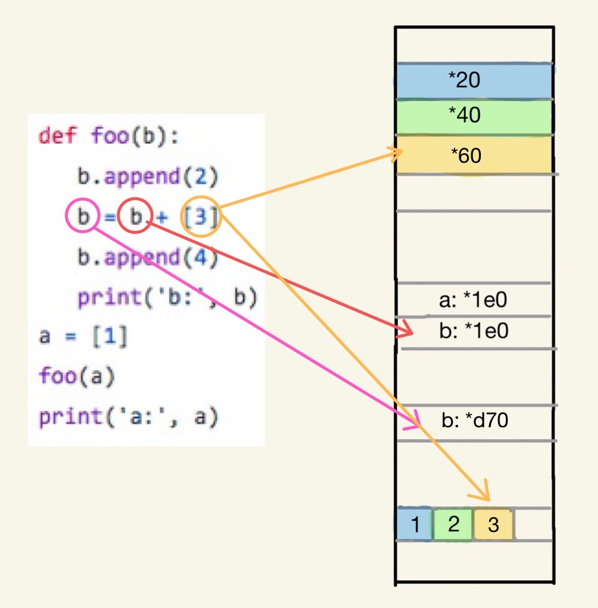
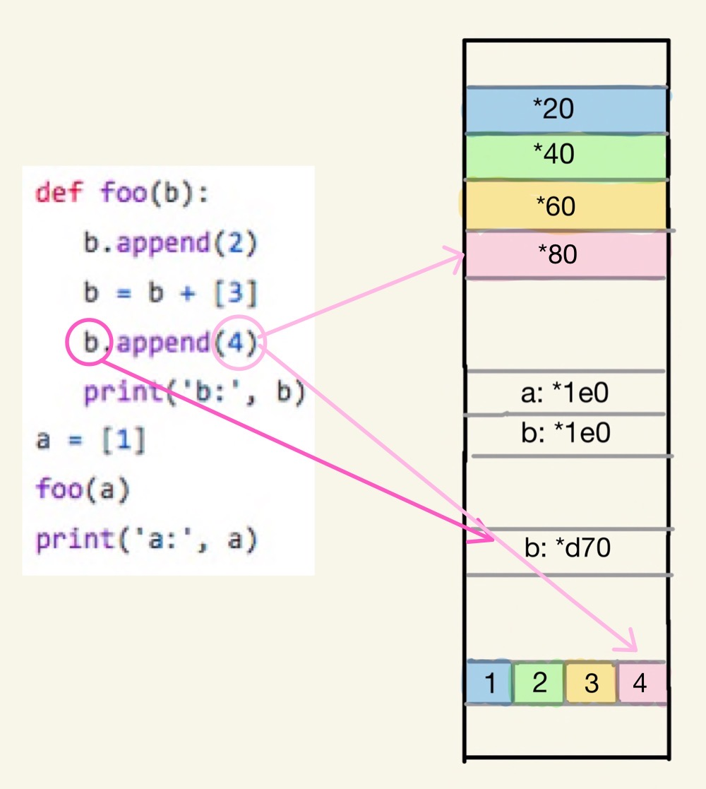
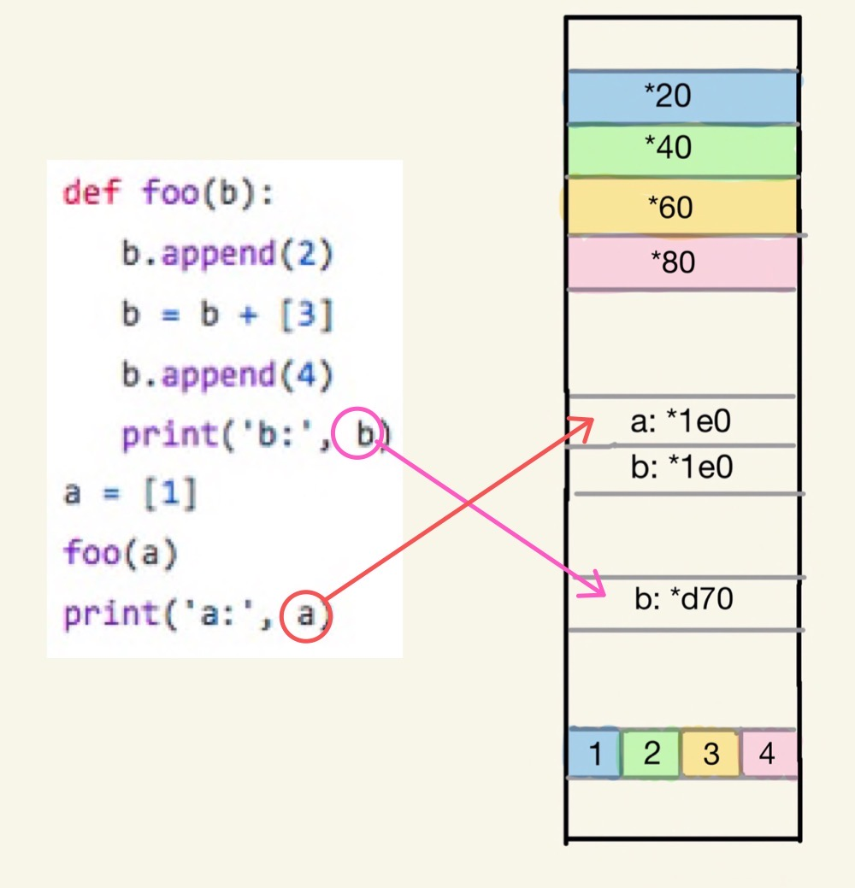

## STEP Week6

### 宿題1<br>
```
def foo(b):
   b.append(2)
   b = b + [3]
   b.append(4)
   print('b:', b)
a = [1]
foo(a)
print('a:', a)
```
を実行すると出力は
```
b: [1, 2, 3, 4]
a: [1, 2]
```
となる。<br>

この関数について、idを使って各変数が指しているアドレスをprintしたうえで、メモリ上でのどのようにデータが保管されているかを説明する。<br>
それを踏まえた上で、なぜ関数内で実行したappendが関数の外で定義した変数に影響を及ぼしてしまうのかを説明する。<br>


a,bだけでなく、その配列の中身のidもprintした。
```
python3 ./homework1.py
```
とすると出力は<br>
```
id(a): 0x10303a1e0
id(b): 0x10303a1e0
id(b[0]): 0x102f37f20
id(b[0]): 0x102f37f20
id(b[1]): 0x102f37f40
id(b): 0x10303a1e0
id(b): 0x103281d70
id(b[0]): 0x102f37f20
id(b[1]): 0x102f37f40
id(b[2]): 0x102f37f60
id(b): 0x103281d70
id(b[0]): 0x102f37f20
id(b[1]): 0x102f37f40
id(b[2]): 0x102f37f60
id(b[3]): 0x102f37f80
b :  [1, 2, 3, 4]
id(a): 0x10303a1e0
a :  [1, 2]
```
となった。この結果から以下のようなことが考えられる。なお、図はメモリを簡略化したものであり、ポインタの番号も説明のために適当に割り振っている。<br>

1. まず、a = [1]とfoo(a)のaは代入しただけなので同じポインタを持つ。以下、ポインタ*1e0を持つaをa(*1e0)と表すこととする。<br>
2. fooの中身を見ていく。def foo(b)のbとしてaを代入したのでこのbはaと同じポインタ(*1e0とする)を持つ。<br>
3. b(*1e0).append(2)、b(*1e0) = [1,2]
4. b = b + [3]。この時、bはb(*d70) = b(*1e0) + [3]となる。<br>
つまり、b(*d70) = [1,2,3], b(*1e0) = [1,2]である。<br>
5. b(*d70).append(4)、b(*d70) = [1,2,3,4]<br>
6. print(b)のbはb(*d70)なので[1,2,3,4]がprintされる。<br>また、print(a)のaはa(*1e0)なのでa(*1e0) = b(*1e0) = [1,2]となり、[1,2]がprintされる。<br>

以上の理由より、aは関数内の計算の影響を受ける。また、それがbと異なった値になる。<br>

<table>
<tr>
<td></td>
<td></td>
</tr>
</table>
<table>
<tr>
<td></td>
<td></td>
</tr>
</table>
<table>
<tr>
<td></td>
</tr>
</table>
